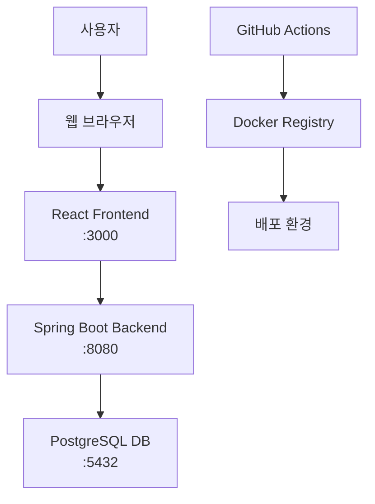
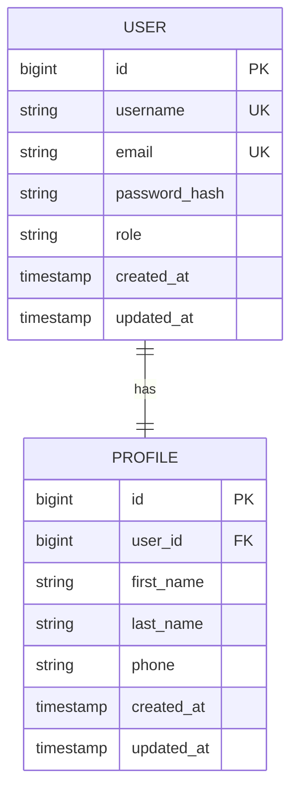

# 아키텍처 문서

## 시스템 개요

KNUT4는 마이크로서비스 아키텍처를 지향하는 웹 애플리케이션으로, 다음과 같은 주요 컴포넌트로 구성됩니다.

## 컴포넌트 구조

### 1. 프론트엔드 (Frontend)
- **기술**: React + TypeScript
- **역할**: 사용자 인터페이스 제공
- **포트**: 3000 (개발), 80 (운영)

### 2. 백엔드 (Backend API)
- **기술**: Spring Boot + Java 17
- **역할**: 비즈니스 로직 처리, REST API 제공
- **포트**: 8080
- **주요 기능**:
  - 사용자 인증/인가 (JWT)
  - CRUD API 엔드포인트
  - 데이터 검증 및 변환

### 3. 데이터베이스 (Database)
- **기술**: PostgreSQL
- **역할**: 데이터 영속성 관리
- **포트**: 5432

## 시스템 흐름도



## 데이터 흐름

1. **사용자 요청**: 웹 브라우저에서 React 앱으로 사용자 입력
2. **API 호출**: React에서 Spring Boot API로 HTTP 요청
3. **인증 확인**: JWT 토큰 검증 (Spring Security)
4. **비즈니스 로직**: Service 계층에서 비즈니스 규칙 처리
5. **데이터 접근**: JPA를 통해 PostgreSQL 데이터베이스 조작
6. **응답 반환**: JSON 형태로 프론트엔드에 결과 전달

## ERD (Entity Relationship Diagram) - 초안



### 주요 엔티티 설명

#### User (사용자)
- 시스템의 기본 사용자 정보
- 인증 및 권한 관리의 기본 단위
- username, email은 유니크 제약

#### Profile (프로필)
- 사용자의 상세 정보
- User와 1:1 관계

## 보안 아키텍처

### 1. 인증 (Authentication)
- JWT (JSON Web Token) 기반
- Access Token + Refresh Token 패턴
- 토큰 만료 시간: Access(1h), Refresh(24h)

### 2. 인가 (Authorization)
- Role-Based Access Control (RBAC)
- Spring Security를 통한 메서드 수준 보안
- API 엔드포인트별 권한 설정

### 3. 데이터 보안
- 비밀번호 해싱 (BCrypt)
- HTTPS 통신 강제
- SQL Injection 방지 (JPA 사용)

## 배포 아키텍처

### 개발 환경
```
Docker Compose
├── frontend:3000
├── backend:8080
└── postgres:5432
```

### 운영 환경 (예정)
- Kubernetes 또는 Docker Swarm
- Load Balancer
- 데이터베이스 클러스터링
- 모니터링 및 로깅

## API 설계 원칙

### 1. RESTful API
- 리소스 기반 URL 설계
- HTTP 메서드 의미론적 사용
- 적절한 HTTP 상태 코드 반환

### 2. 버저닝
- URL 경로 기반: `/api/v1/users`
- 하위 호환성 유지

### 3. 응답 형식
```json
{
  "success": true,
  "data": {},
  "message": "Success",
  "timestamp": "2024-01-01T00:00:00Z"
}
```

## 성능 고려사항

### 1. 캐싱 전략
- Redis 도입 예정 (세션, 쿼리 결과)
- HTTP 캐시 헤더 활용

### 2. 데이터베이스 최적화
- 인덱스 설계
- 쿼리 최적화
- 커넥션 풀 관리

### 3. 모니터링
- 애플리케이션 메트릭 수집
- 로그 중앙화
- 성능 대시보드

## 확장성 계획

### 단기 (MVP)
- 단일 인스턴스 배포
- 기본 CRUD 기능

### 중기
- 마이크로서비스 분리
- 캐시 계층 도입
- 로드 밸런싱

### 장기
- 서비스 메시 도입
- 이벤트 기반 아키텍처
- 글로벌 배포

---

*이 문서는 프로젝트 진행에 따라 지속적으로 업데이트됩니다.*